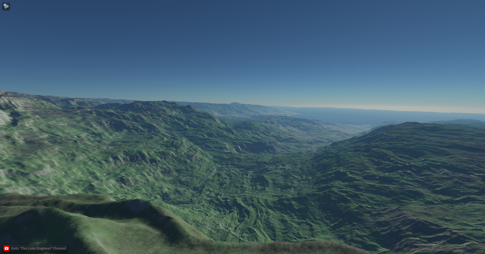
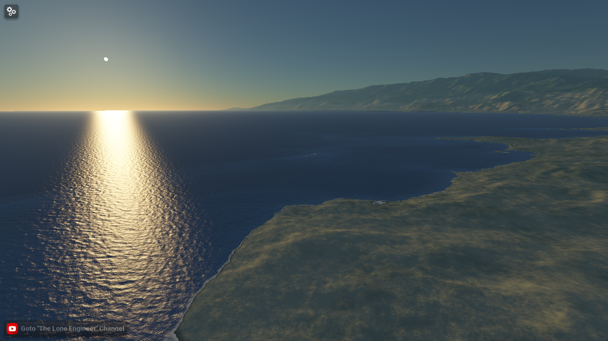
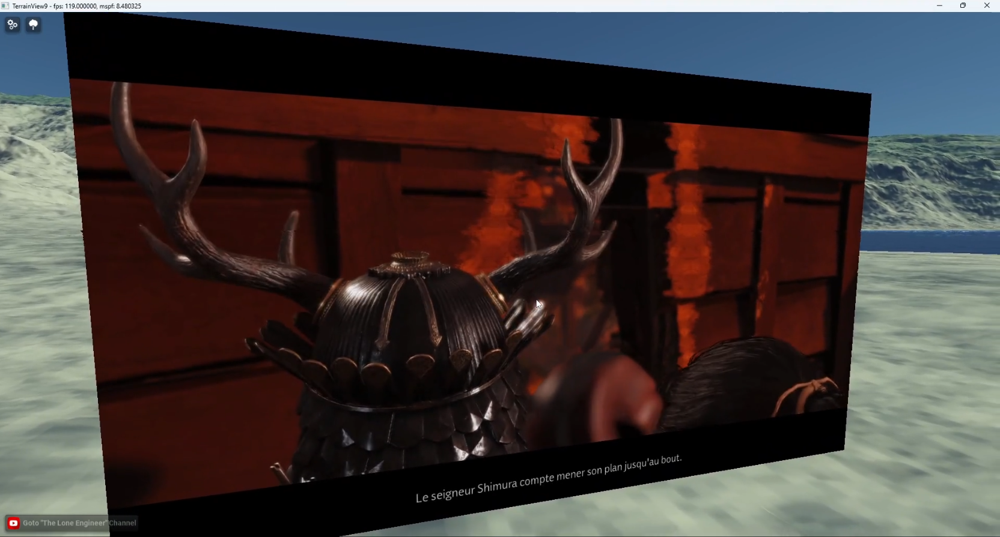

# NervLand Adventures

Collection of small experiments and coding adventures with my NervLand engine providing some code snippets.

**Important note**: Most of the experimental code provided here either directly or indirectly depends on the "NervLand" engine that I'm currently building on my own, and I'm keeping that project private for the moment, so you **wont be able to just take the code here and build it**. This repository is rather here to share some reference code snippets which you might use to generate some working code in your environment or simply to study the algorithms, etc.

# The experiments

## 001 - WGPU Reduction algorithm

- Folder: **001_wgpu_reduction**
- References:
  - Video Tutorial Part 1: https://www.youtube.com/watch?v=198AoKCB90o
  - Video Tutorial Part 2: https://www.youtube.com/watch?v=R0P9DDRCQ68

This is currently provided as a single C++ unit test file and a collection of wgsl shader files implementing different versions of the reduction algorithm. The unit test will execute the computation with each version and monitor the time taken to compute the bandwidth of the compute shader.

## 002 - WGPU Prefix Sum

- Folder: **002_wgpu_prefix_sum**
- References:
  - Video Tutorial: https://www.youtube.com/watch?v=wD2RezUqaxc

This experiment is a simple continuation from the previous one on the reduction algorithms, this time focusing on prefix-sum computation in WGSL. Again, we are only providing some minimal unit test code in C++ here and the different versions of the compute shaders which may be used as reference for integration into another WebGPU based engine.

## 003 - WGPU Native/WASM app

- Folder: **003_wgpu_native_wasm_app**
- References:
  - Video Tutorial: **to be released**

In this folder you will find the 4 test applications I built to reach a simple code base which could now be used to build a WebGPU base app both as a native application or as a WASM application to run in your browser.

Those test apps do not depend on the NervLand libraries so it should be possible to build them with the provided code without too much trouble (assuming you have a proper emscripten toolchain available for the build process)

## 004 - TerrainView5

**TODO**

## 005 - TerrainView6

**TODO**

## 006 - TerrainView7

The TerrainView7 tech demo app introduces support for the Precomputed Atmospheric Scattering on the terrain rendering layer.

- If your browser supports WebGPU, you can give this demo a try at: https://nervtech.org/terrainview7
- And if you want a quick overview on the new features/changes I introduced in this release compared to the **TerrainView6**, you can check the companion video at: https://www.youtube.com/watch?v=85-VGX808xA

## 007 - TerrainView8

The TerrainView8 tech demo app introduces support for **Real-time Realistic Ocean Lighting using Seamless Transitions from Geometry to BRDF**.

- If your browser supports WebGPU, you can give this demo a try at: https://nervtech.org/terrainview8
- And if you want a quick overview on the new features introduced in this release you can check the companion video at: https://www.youtube.com/watch?v=uUomhFu364I

The ocean surface rendering is based on the implementation from Eric Bruneton's paper "Real-time Realistic Ocean Lighting using Seamless Transitions from Geometry to BRDF" (available at: https://hal.science/inria-00443630) which itself uses the model from Elfouhaily's paper "A unified directional spectrum for long and short wind-driven waves" (https://agupubs.onlinelibrary.wiley.com/doi/abs/10.1029/97jc00467)

The main contribution I'm introducing here is a full port of the spectrum/slopes variance/FFT computation in WebGPU compute shaders (original version is computing the spectrum only on CPU) plus a few extensions to support foam display at the top of the waves and at shores, as well as dynamic control on the wind direction.

This algorithm also handles displaying the sea bedrock surface under the water surface using a simple Beer-Lambert Law application.

There is still some work to do on this, including the following points:

- [ ] Support for underwater sea surface display
- [ ] Caustics display
- [ ] Improvements on the screen grid projection range
- [ ] Local ocean parameters control
- [ ] Better foam rendering and addition of sea spray
- [ ] Improvements on the shore waves display

## 008 - FFmpeg video Playback in Native WGPU

This experiment was a simple test to try to use the "Shared Texture" API from Dawn by importing an ffmpeg video stream generated with DirectX 11.

The code files here are provided as **basic reference**, they will not compile out of the box as this depends on the NervLand engine which is not open-sourced for now. But this will anyway provide a good overview on most of the specific points to consider to setup the video stream playback with full hardware acceleration.

**Note:** This experiment was implemented **on Windows only**, linux would require a different processing pipeline obviously 😄.
