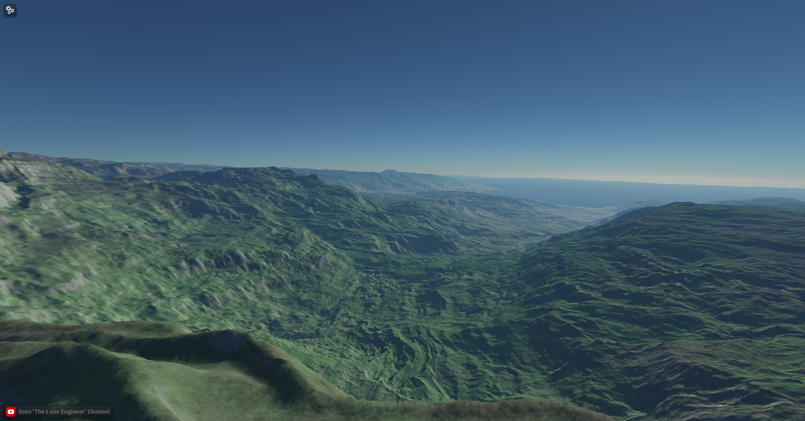
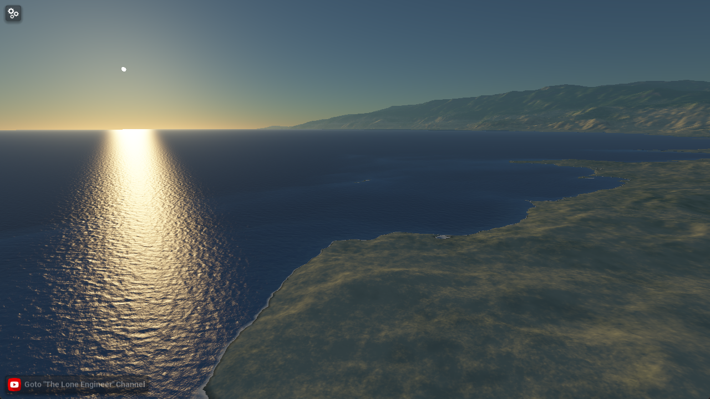
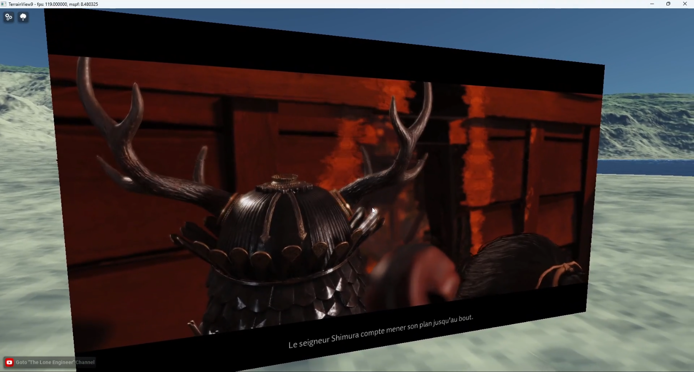
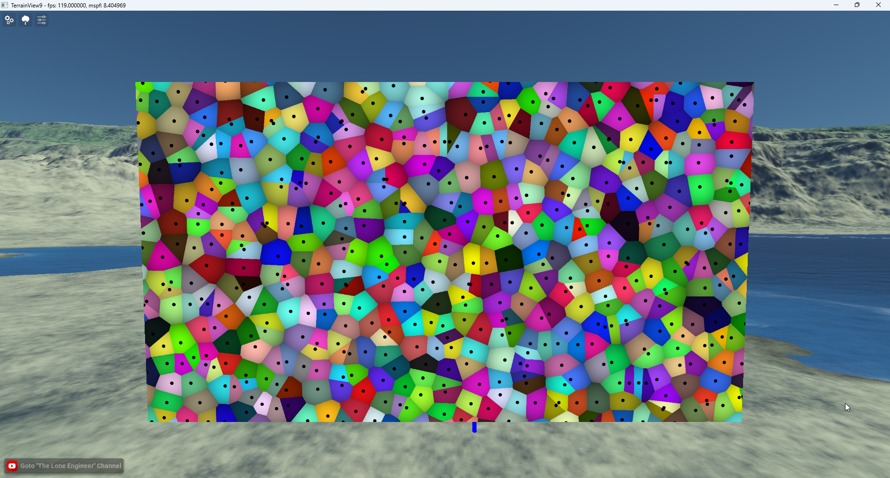

# 🌟 NervLand Adventures

Welcome to **NervLand Adventures** — a collection of experimental projects, technical demonstrations, and coding explorations built on the NervLand engine.

> **Note:** Most experiments here depend on my private **NervLand** engine. While you won't be able to build these projects directly, the code serves as valuable reference material for algorithms, implementation patterns, and WebGPU techniques.

---

## 🎯 About This Repository

This repository showcases various graphics programming experiments, rendering techniques, and procedural generation systems. Each experiment is documented with reference code, shader implementations, and accompanying video tutorials to help you understand and adapt these techniques for your own projects.

Whether you're interested in GPU computing, terrain rendering, procedural generation, or WebGPU development, you might find some interesting examples and insights here.

This main page also provide access to the sub-projects online apps that you may freely test and use.

---

## 🚀 Featured Sub-Projects

### [NervForge](https://nervtech.org/nervforge/) — Procedural Tree Generator

A powerful procedural 3D tree generation tool that allows you to create customizable tree models and export them as glTF files.

**Key Features:**

- Multi-level branch generation with customizable density and distribution
- Realistic branch physics with gnarliness and curvature controls
- Dynamic leaf system with multiple textures and tint colors
- Attraction/repulsion systems for natural branch distribution
- Custom texture rendering and upload support
- Export to glTF/GLB format for use in other 3D applications
- Comprehensive configuration system with preset templates (Maple, Willow, etc.)

**Resources:**

- 🌐 [Try it online](https://nervtech.org/nervforge/)
- 📺 Tutorial Series: **TODO** Videos 33-41 cover feature development and usage

---

### [TerrainView7](https://nervtech.org/terrainview7) — Atmospheric Scattering

An advanced terrain rendering demo featuring precomputed atmospheric scattering for realistic sky and lighting effects.

**Key Features:**

- Precomputed atmospheric scattering implementation
- Realistic sky rendering with day/night cycles
- Advanced terrain LOD system
- WebGPU-powered rendering pipeline

**Resources:**

- 🌐 [Live Demo](https://nervtech.org/terrainview7) (WebGPU required)
- 📺 [Overview Video](https://www.youtube.com/watch?v=85-VGX808xA)

---

### [TerrainView8](https://nervtech.org/terrainview8) — Realistic Ocean Rendering

Real-time ocean rendering with seamless transitions from geometry to BRDF, featuring dynamic waves and foam.

**Key Features:**

- Based on Eric Bruneton's ocean lighting research paper
- Full WebGPU compute shader implementation for spectrum/FFT computation
- Elfouhaily wave spectrum model for realistic wave patterns
- Dynamic foam rendering at wave peaks and shores
- Beer-Lambert Law for underwater bedrock visualization
- Controllable wind direction and wave parameters

**Resources:**

- 🌐 [Live Demo](https://nervtech.org/terrainview8) (WebGPU required)
- 📺 [Feature Overview](https://www.youtube.com/watch?v=uUomhFu364I)
- 📄 [Research Paper](https://hal.science/inria-00443630)

---

## 🧪 Technical Experiments

### 001 — WGPU Reduction Algorithm

GPU-based parallel reduction implementations with performance benchmarking.

- Multiple shader variants exploring different optimization strategies
- Bandwidth monitoring and performance analysis
- 📺 [Tutorial Part 1](https://www.youtube.com/watch?v=198AoKCB90o) | [Part 2](https://www.youtube.com/watch?v=R0P9DDRCQ68)
- 📁 `experiments/001_wgpu_reduction/`

---

### 002 — WGPU Prefix Sum

Parallel prefix sum (scan) algorithm implementation in WGSL compute shaders.

- Building on reduction algorithm concepts
- Multiple optimization variants
- 📺 [Tutorial Video](https://www.youtube.com/watch?v=wD2RezUqaxc)
- 📁 `experiments/002_wgpu_prefix_sum/`

---

### 003 — WGPU Native/WASM App

Cross-platform WebGPU application framework supporting both native and web deployment.

- **Self-contained** — No NervLand dependencies, can be built standalone
- Emscripten toolchain for WASM compilation
- Single codebase for native and browser targets
- 📁 `experiments/003_wgpu_native_wasm_app/`

---

### 004 — FFmpeg Video Playback in Native WGPU

Hardware-accelerated video playback using DirectX 11 and Dawn's Shared Texture API.

- DirectX 11 video stream generation
- WebGPU texture sharing and rendering
- Full hardware acceleration pipeline
- **Windows only** implementation
- 📺 [Implementation Tutorial](https://www.youtube.com/watch?v=P1jxvLm6SwE)
- 📁 `experiments/008_ffmpeg_video_playback/`

---

### 005 — Procedural Voronoi Texture Generation

GPU-based procedural Voronoi diagram generation with progressive complexity.

- Beginner-friendly iterative implementation
- Multiple shader versions showing progression
- Complete compute shader workflow
- 📺 [Video Tutorial](https://www.youtube.com/watch?v=kNgqw7HKzmg)
- 📝 [Written Tutorial](https://dev.to/the_lone_engineer/tutorial-procedural-voronoi-texture-generation-in-wgpu-1b3k)
- 📁 `experiments/005_procedural_voronoi/`

---

## 🛠️ Technologies

- **WebGPU** — Modern GPU API for graphics and compute
- **WGSL** — WebGPU Shading Language
- **C++** — Core engine implementation
- **Emscripten** — WASM compilation for web deployment
- **glTF** — 3D model export format

---

## 🔗 Related Projects

- **NervSDK** — Open-source framework with base components ([GitHub](https://github.com/roche-emmanuel/NervSDK))
  - Custom glTF implementation (`sources/nvk/gltf`)
  - Cross-platform base utilities
  - Built with NervProj mechanism
- **NervProj** — Open-source project management framework ([GitHub](https://github.com/roche-emmanuel/NervProj))

---

## 📬 Feedback & Questions

Have questions about implementation details? Feel free to open an issue or reach out through the video comments or ask on the [💬 project sub-reddit](https://www.reddit.com/r/Project_NervLand/)

---

## ⚖️ License

Reference code provided for educational purposes. Everything provided here is under MT license.

---

**[📺 YouTube Channel](https://studio.youtube.com/)** | **[💬 Community](https://www.reddit.com/r/Project_NervLand/)**

_Building the future of graphics programming, one experiment at a time._

